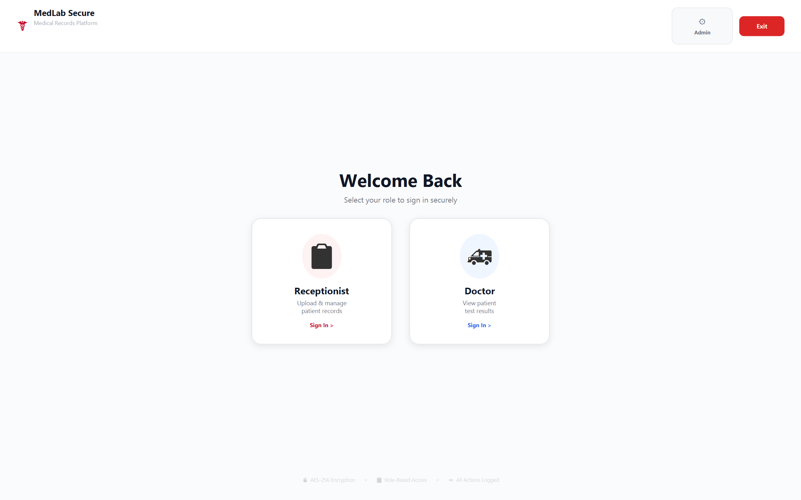
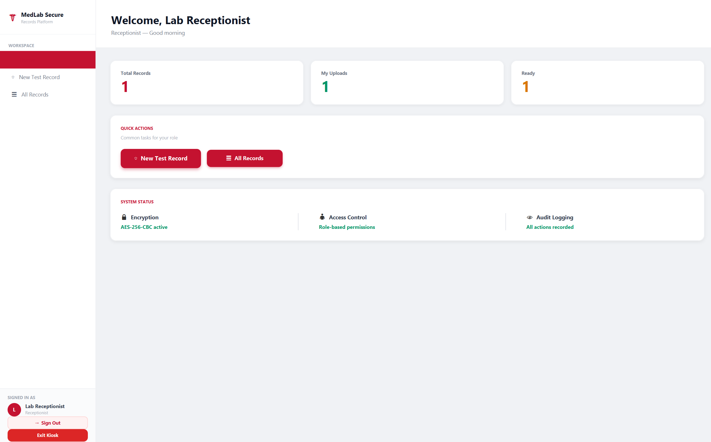
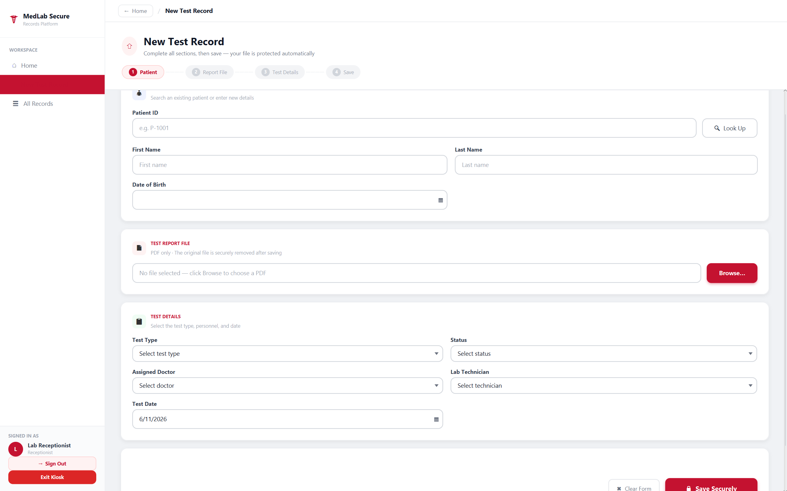
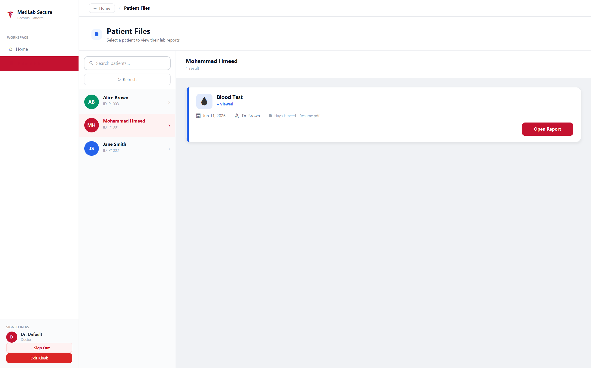

# Secure Medical Laboratory System

Secure Medical Laboratory System is an academic desktop application built with Java, JavaFX, and PostgreSQL.  
The system is designed to help medical laboratories manage patient records and medical test files in a secure and organized way.

The main focus of this project is protecting sensitive medical documents using AES-256 encryption, while applying role-based access control for different types of users.

## Project Overview

In medical environments, patient records and lab test files contain sensitive information that should not be stored or accessed without proper protection.

This system provides a secure workflow where:
- Receptionists can manage patients and upload encrypted medical files.
- Doctors can view patient test results.
- Admins can manage users, view audit logs, and access recovery tools.

The application also supports kiosk mode, making it suitable for controlled lab environments.

## Features

- Secure login system
- Role-based access control
- Admin, Doctor, and Receptionist roles
- AES-256 encryption and decryption for medical files
- PostgreSQL database integration
- Patient and test record management
- Encrypted file upload
- Doctor view for patient results
- Admin panel for user management
- Audit log for tracking user activity
- File recovery tools
- Kiosk mode with protected exit
- Clean JavaFX desktop interface

## User Roles

### Admin
- Manage users
- View audit logs
- Access recovery tools
- Control system-level features

### Receptionist
- Add and manage patient records
- Upload medical test files
- Manage patient-related information

### Doctor
- Search and view patient records
- Access test results
- Open decrypted medical files based on permissions

## Screenshots

### Home / Role Selection Screen



### Receptionist Dashboard



### Add Patient / Upload Record Screen



### Doctor View



## Security Features

The system uses AES-256 encryption to protect uploaded medical files.  
Only authorized users can access specific features based on their role.

The project also includes activity logging to improve accountability and help track important user actions inside the system.

## Tech Stack

- Java
- JavaFX
- PostgreSQL
- JDBC
- AES-256 Encryption
- PDFBox
- CSS

## Database

The system uses PostgreSQL as the main database.

Main database features include:
- Patient records
- User accounts
- Medical files
- Encrypted file keys
- Audit logs
- Role-based permissions

## How to Run

Run the application using:

```bash
START_APP.bat
```

The script checks the database, applies migrations, builds the project, and starts the application.

## Default Users

```text
Admin:        Admin@1234
Doctor:       Doctor@1234
Receptionist: Recep@1234
```

## Academic Context

This project was developed as a university software engineering project by a Computer Engineering student.

It helped me apply important concepts such as desktop application development, database design, encryption, authentication, access control, secure file management, and role-based system design.

## Author

Developed by Mohammad Hmeed

GitHub: https://github.com/mohammadhmeed2843
